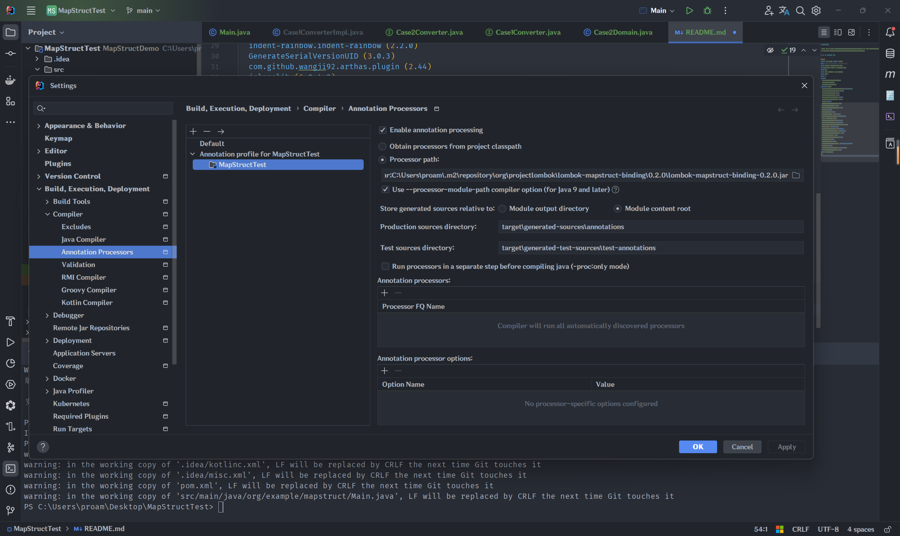
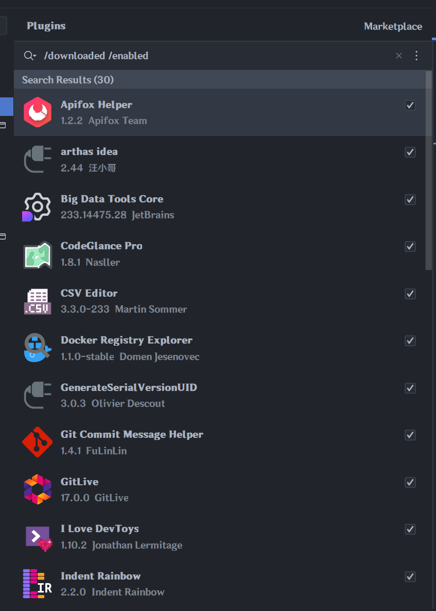
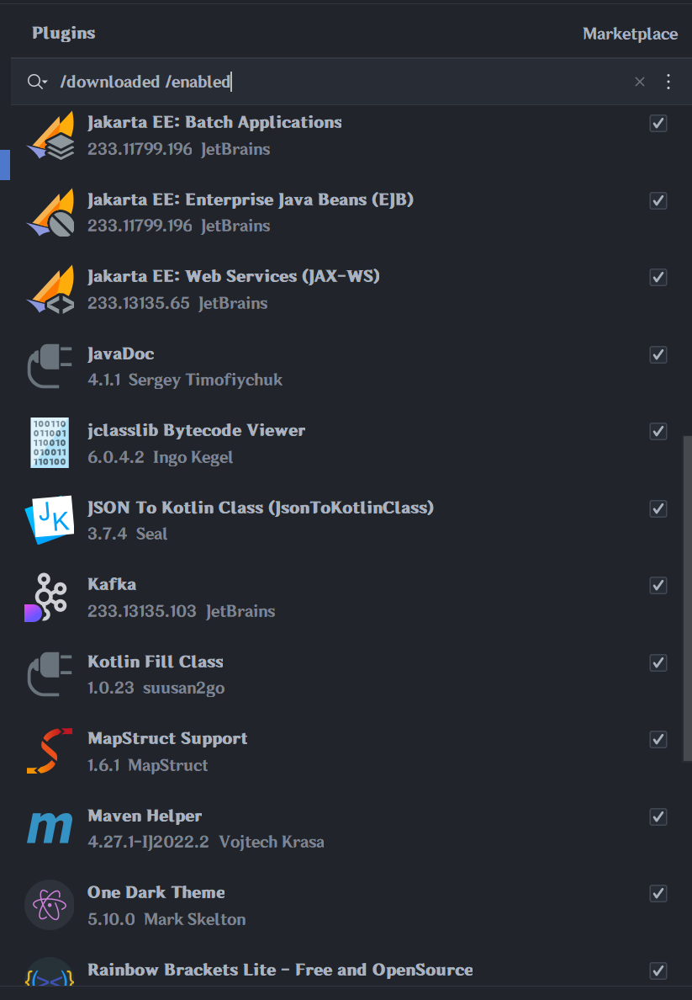
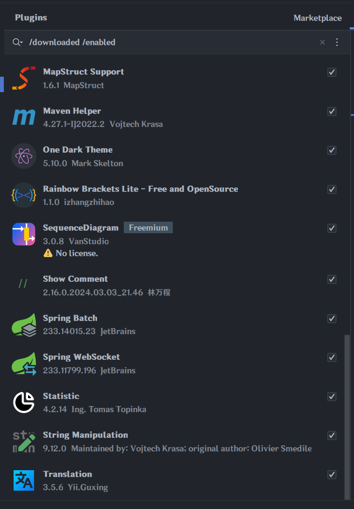

# MapStructDemo

> Sample case for project [MapStruct](https://github.com/mapstruct/mapstruct)'s idea
> plugin [mapstruct-idea](https://github.com/mapstruct/mapstruct-idea)    
> For resolving issue[#182](https://github.com/mapstruct/mapstruct-idea/issues/182).  
> For convenience, add idea's workspace configuration into git repo as well.

## IDE AND ENVIRONMENT INFO

```shell
IntelliJ IDEA 2023.3.4 (Ultimate Edition)
Build #IU-233.14475.28, built on February 13, 2024
Runtime version: 17.0.10+1-b1087.17 amd64
VM: OpenJDK 64-Bit Server VM by JetBrains s.r.o.
Windows 11.0
GC: G1 Young Generation, G1 Old Generation
Memory: 4096M
Cores: 12
Registry:
  debugger.new.tool.window.layout=true
  ide.experimental.ui=true
  editor.minimap.enabled=true
Non-Bundled Plugins:
  com.github.exidcuter.dockerregistryexplorer (1.1.0-stable)
  commit-message-helper-idea-plugin (1.4.1)
  com.nasller.CodeGlancePro (1.8.1)
  wu.seal.tool.jsontokotlin (3.7.4)
  lermitage.intellij.ilovedevtoys (1.10.2)
  com.markskelton.one-dark-theme (5.10.0)
  Statistic (4.2.14)
  indent-rainbow.indent-rainbow (2.2.0)
  GenerateSerialVersionUID (3.0.3)
  com.github.wangji92.arthas.plugin (2.44)
  jclasslib (6.0.4.2)
  com.github.setial (4.1.1)
  com.jetbrains.jax.ws (233.13135.65)
  com.intellij.spring.websocket (233.11799.196)
  String Manipulation (9.12.0)
  com.intellij.javaee.ejb (233.11799.196)
  com.intellij.spring.batch (233.14015.23)
  net.seesharpsoft.intellij.plugins.csv (3.3.0-233)
  MavenRunHelper (4.27.1-IJ2022.2)
  com.intellij.javaee.batch (233.11799.196)
  com.intellij.bigdatatools.core (233.14475.28)
  izhangzhihao.rainbow.brackets.lite (1.1.0)
  org.mapstruct.intellij (1.6.1)
  com.suusan2go.kotlin-fill-class (1.0.23)
  SequenceDiagram (3.0.8)
  com.apifox.uploader (1.2.2)
  io.github.linwancen.show-comment (2.16.0.2024.03.03_21.46)
  app.teamhub (17.0.0)
  com.intellij.bigdatatools.kafka (233.13135.103)
  cn.yiiguxing.plugin.translate (3.5.6)
Kotlin: 233.14475.28-IJ
```

## Annotation processors setting options



## Installed Plugins (Check if issue was caused by the incompatible plugin)

**N.B. only shows enabled and downloaded**



